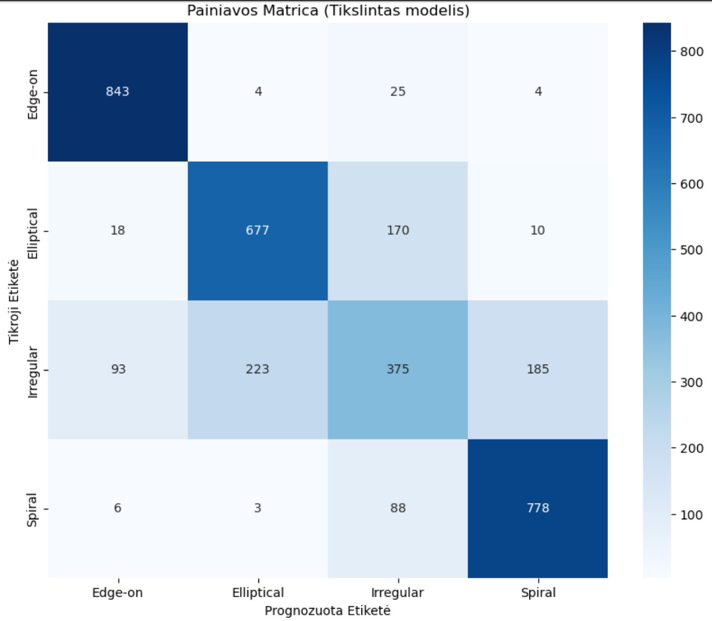
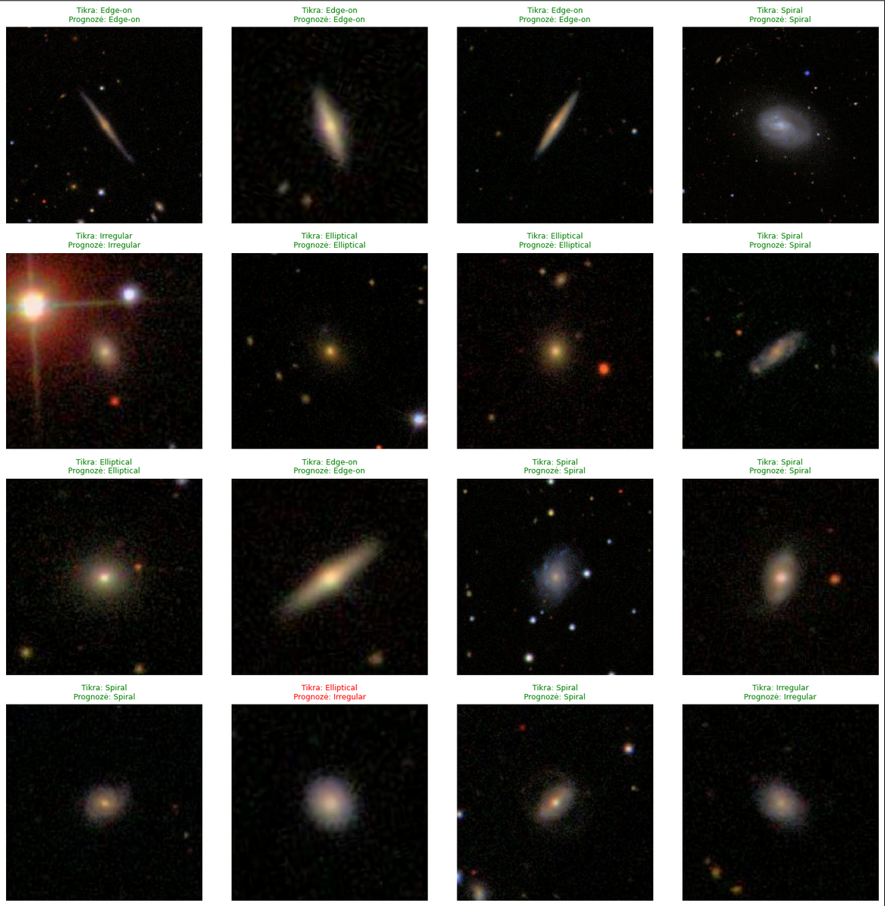

# Galaxy Classification with Deep Learning

This project uses a Convolutional Neural Network (CNN) to classify galaxies based on their morphology from the Galaxy Zoo dataset. The model is built using TensorFlow and Keras, employing transfer learning with a pre-trained ResNet50V2 architecture.

---

### Project Goal / Tikslas

**EN:** The goal is to create an automated solution that, given an image of a galaxy, determines its morphological type (e.g., Elliptical, Spiral, Edge-on, Irregular). This helps astronomers more efficiently process and analyze vast catalogs of celestial bodies.

**LT:** Sukurti sprendimą, kuris, pateikus galaktikos nuotrauką, nustatytų jos tipą (pvz., spiralė, elipsė, iš šono matoma, netaisyklinga), taip padedant astronomams greičiau tvarkyti ir analizuoti dangaus kūnų katalogus.

### Key Features
- **Model:** ResNet50V2, pre-trained on ImageNet.
- **Methodology:** Transfer learning followed by fine-tuning.
- **Dataset:** Galaxy Zoo challenge data, balanced using undersampling.
- **Classes (4):** `Elliptical`, `Spiral`, `Edge-on`, `Irregular`. The original `Peculiar` class was merged into `Irregular` for simplification and better performance.

---

### Final Results

The fine-tuned model achieved a **76.33% accuracy** on the test set.

#### Confusion Matrix
The confusion matrix below shows the model's performance for each class. It performs very well on `Edge-on` and `Spiral` galaxies but has some difficulty distinguishing `Irregular` galaxies, sometimes confusing them with `Elliptical` or `Spiral` types.



#### Classification Report

|              | precision | recall | f1-score | support |
|--------------|-----------|--------|----------|---------|
|    **Edge-on** |      0.88 |   0.96 |     0.92 |     876 |
| **Elliptical** |      0.75 |   0.77 |     0.76 |     875 |
|  **Irregular** |      0.57 |   0.43 |     0.49 |     876 |
|     **Spiral** |      0.80 |   0.89 |     0.84 |     875 |
|              |           |        |          |         |
|     accuracy |           |        |     0.76 |    3502 |
|    macro avg |      0.75 |   0.76 |     0.75 |    3502 |
| weighted avg |      0.75 |   0.76 |     0.75 |    3502 |

---

### Sample Predictions

Here are some sample predictions from the model. The title shows the true label, and the subtitle shows the model's prediction. Green indicates a correct prediction, while red indicates an error.



---

### Setup and Usage

To run this project yourself, follow these steps:

1.  **Clone the repository:**
    ```bash
    git clone https://github.com/YOUR_USERNAME/galaxy-classifier-showcase.git
    cd galaxy-classifier-showcase
    ```

2.  **Create a Python virtual environment (recommended):**
    ```bash
    python -m venv env
    source env/bin/activate  # On Windows, use `env\Scripts\activate`
    ```

3.  **Install the required libraries:**
    ```bash
    pip install -r requirements.txt
    ```

4.  **Download the Image Data:**
    - Go to the [Kaggle Galaxy Zoo Challenge Data Page](https://www.kaggle.com/competitions/galaxy-zoo-the-galaxy-challenge/data).
    - Download `images_training_rev1.zip`.
    - Unzip the file and move all the `.jpg` images into the `data/images_training_rev1/` directory.

5.  **Run the Jupyter Notebook:**
    - Launch Jupyter Lab or Jupyter Notebook:
      ```bash
      jupyter lab
      ```
    - Open the `Galaxy_Classification.ipynb` notebook and run the cells. You can run the evaluation and prediction cells directly, as the pre-trained model is included.

---

### File Structure
```
.
├── data/                    # Project data
│   ├── training_solutions_rev1.csv
│   └── images_training_rev1/
│       └── placeholder.txt  # Instructions to download images
├── models/                  # Trained Keras model
│   └── best_galaxy_classifier_finetuned_224px_4class_balanced.keras
├── Galaxy_Classification.ipynb # Main notebook with all the code
├── confusion_matrix.png     # Result image for README
├── sample_predictions.png   # Result image for README
├── .gitignore               # Files to be ignored by Git
├── README.md                # This file
└── requirements.txt         # Python dependencies
```
# Galaxy_Classification
# Galaxy_Classification
# galaxy-classifier-showcase
